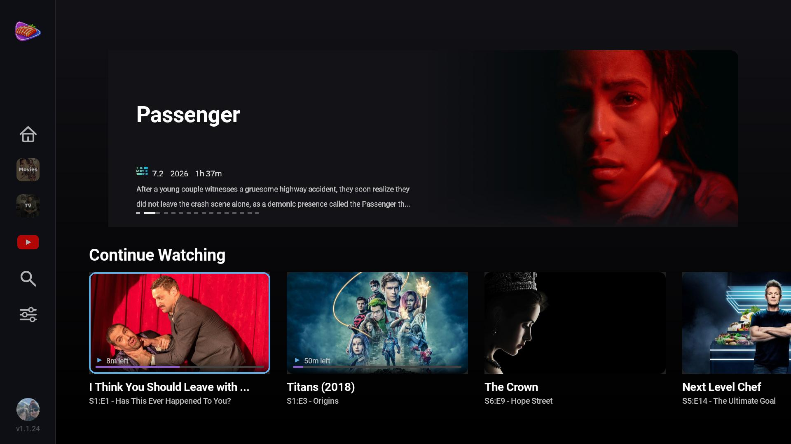
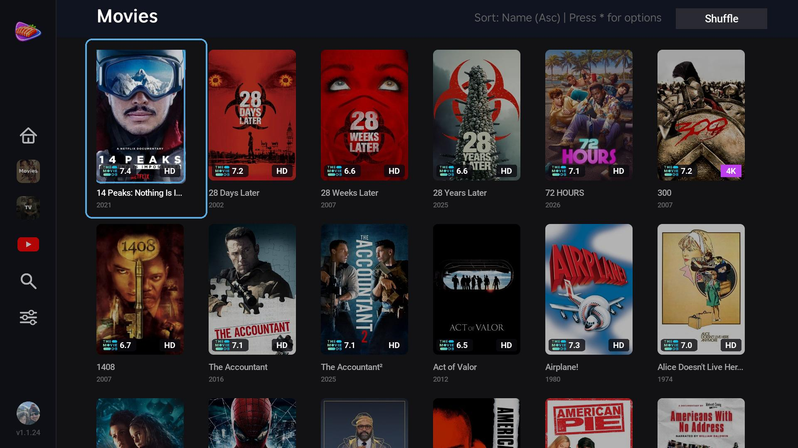
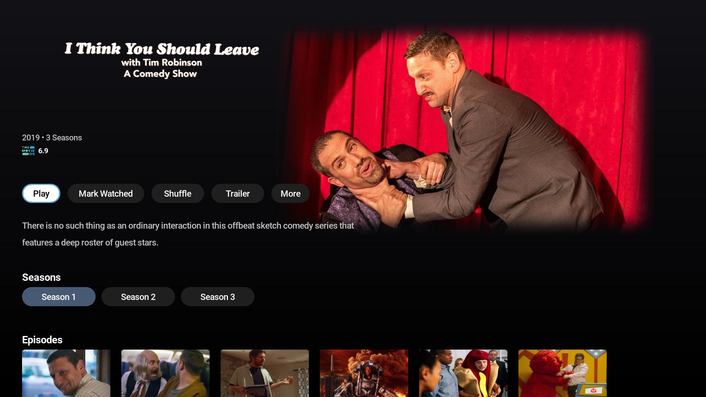
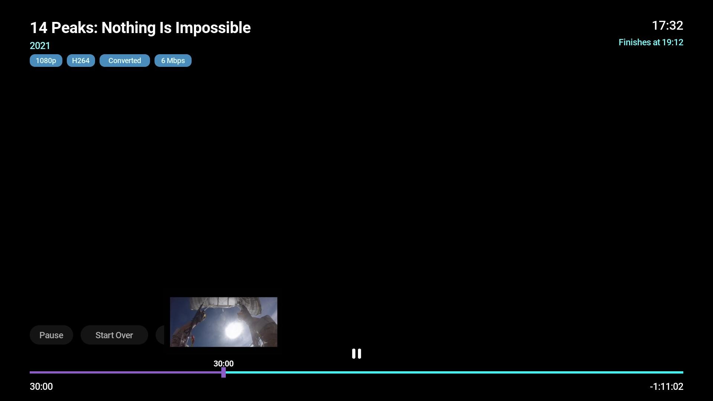

# Sashimi for Roku

<p align="center">
  
</p>

<p align="center">
  <strong>A native Jellyfin client for Roku</strong>
</p>

<p align="center">
  <a href="#screenshots">Screenshots</a> •
  <a href="#features">Features</a> •
  <a href="#requirements">Requirements</a> •
  <a href="#installing">Installing</a> •
  <a href="#settings">Settings</a> •
  <a href="#troubleshooting">Troubleshooting</a> •
  <a href="#development">Development</a> •
  <a href="#contributing">Contributing</a>
</p>

---

Sashimi is a Roku channel for [Jellyfin](https://jellyfin.org/) media servers,
written in BrightScript and SceneGraph. It talks only to the Jellyfin server you
point it at — there is no Sashimi account, no telemetry, and no third-party
network traffic.

It is the Roku member of the Sashimi family; sibling clients for
[Apple TV / iPhone / iPad](https://github.com/bitstorm-labs/sashimi-apple) and
[Android](https://github.com/bitstorm-labs/sashimi-android) live in their own
repositories and aim for visual and feature parity.

## Screenshots



*Home — a hero banner that rotates through featured items, above Continue
Watching and a "Recently Added" row per library. The collapsed sidebar on the
left expands when focused.*



*Library — poster grid with quality and rating badges. The header shows the
active sort and filter; `*` opens the sort/filter menu, and Shuffle plays one
random item.*



*Detail — series logo art, action buttons, season pills and an episode row.
Movies use the same layout without seasons.*



*Player — stream info chips (resolution, codec, Original/Converted, bitrate), a
"Finishes at" estimate, and trick-play thumbnails while scrubbing.*

## Features

### Browsing

- **Pullout sidebar** — a collapsed icon rail that expands over the content when
  focused. It holds Home, each of your libraries, Search, Settings and an
  account row. Press LEFT from a top-level screen to reveal it.
- **Home screen** — a hero banner that rotates through featured items every few
  seconds (LEFT/RIGHT pages through it manually), a **Continue Watching** row,
  and a **Recently Added** row for each library. Continue Watching merges your
  in-progress items with Jellyfin's Next Up, so a just-finished episode surfaces
  its successor.
- **Configurable home rows** — reorder rows or hide them from
  *Settings → Home Screen Rows*.
- **Library grid** with sorting by Name, Date Added, Release Date, Rating or
  Runtime, an independent Ascending/Descending toggle, and filtering by All,
  Unwatched, Watched or Favorites. Press `*` for the menu; the header always
  shows what is currently applied.
- **A–Z jump bar** — press RIGHT from the grid in any library to reveal an
  alphabet rail (plus a `#` bucket for titles that start with a digit or symbol)
  and jump straight to a letter. LEFT dismisses it.
- **Shuffle** — press UP from the top row of a Movies or TV library to reach the
  Shuffle button and play one random item. Series detail screens have their own
  Shuffle button for a random episode.
- **Search** across movies and series, with a **recent search history** — the
  last 10 queries, with a "Clear Recent Searches" entry.
- **Quality badges** (4K / HD / SD) and **community ratings** on artwork, both
  individually toggleable. Episode tiles can show either the episode's own
  rating or the parent series' rating.
- **Unplayed counts, watched checks and progress bars** on cards.
- **Pinchflat / YouTube libraries** are detected by name and rendered with
  circular channel avatars and channel-style titles.

### Detail screens

- **Play** / **Resume** (with a separate **Start Over**), **Mark Watched**,
  **Shuffle** for series, **Series** to jump from an episode to its parent, and
  a **More** menu holding the full overview and the **Favorite** toggle.
- **Trailer** — appears when Jellyfin reports a local trailer for the item
  (`LocalTrailerCount > 0`, e.g. one downloaded by
  [Trailarr](https://github.com/nandyalu/trailarr)). It opens the trailer in the
  normal player. Remote and YouTube-hosted trailers are not supported.
- **Seasons and episodes** — season pills plus an episode row for series; an
  episode's own screen shows a "More Episodes" strip with the current episode
  marked. A **Cast** row lists up to 20 actors.
- **Ratings** — the community score with the TMDb mark and, where Jellyfin has
  one, the critic score with a Rotten Tomatoes mark. Both logos are bundled
  images; Sashimi makes no requests to TMDb or Rotten Tomatoes.
- **Media badges** — resolution, video codec, and Dolby Digital / Digital Plus /
  TrueHD wordmarks for the primary audio track, otherwise a codec and
  channel-layout chip. Movies also get official-rating and genre chips.

### Playback

- **Trick-play scrubbing** — thumbnail previews while seeking, drawn from
  Jellyfin's trickplay tile sheets. Tile geometry is read from each item's own
  `Trickplay` metadata rather than assumed. See
  [Troubleshooting](#no-trick-play-thumbnails-while-scrubbing) if you see none.
- **Chapters** — a chapters menu plus tick marks on the scrub bar, for items
  with more than one chapter.
- **Intro Skipper support** — a "Skip Intro" / "Skip Credits" pill on episodes,
  backed by the
  [Intro Skipper](https://github.com/intro-skipper/intro-skipper) Jellyfin
  plugin, with optional auto-skip for each (both off by default).
- **Auto-play next episode** (on by default).
- **Audio and subtitle track selection.** Subtitles are burned in server-side,
  which makes every format work — SRT, styled ASS, image-based PGS — at the cost
  of a stream restart. See [Known limitations](#subtitle-changes-restart-the-stream).
- **Roku's system caption setting is honoured** — turning captions on or off in
  Roku's own settings selects or clears a subtitle track.
- **Adaptive fallbacks** — a direct play the hardware rejects retries once over
  HLS, and a stall or a transcode that never starts steps the bitrate down
  through 12 / 8 / 5 / 3 Mbps before surfacing an error. *Always Play Original*
  opts out of both.
- **Stream info on the overlay** — resolution, video codec, whether the stream is
  **Original** or **Converted**, the delivered bitrate, a clock, and a
  "Finishes at" estimate.
- **Accelerating seek** — repeated presses in the same direction step 10s → 20s →
  40s → 60s, with the scrub bar and thumbnail previewing before the seek commits.
- **Progress reporting** — position is reported to Jellyfin on start, every five
  seconds, on pause and on stop, so resume works across all your clients. The
  resume threshold is configurable.

### Connecting

- **LAN server discovery** — broadcasts Jellyfin's standard
  `"Who is JellyfinServer?"` probe on **UDP 7359** and lists whatever replies
  within about three seconds. Manual URL entry always works too.
- **Multi-server** — add as many servers as you like and switch between them
  from the sidebar account row or *Settings → Servers*; the libraries reload for
  the newly active server.
- **Deep linking** via ECP (`supports_input_launch`). `movie`, `episode`,
  `series`, `shortformvideo`, `tvspecial`, `livefeed` and `sportsevent` begin
  playback immediately, with `series` resolving to your next unwatched episode.
  Other types, including `season`, open the detail screen.

## Requirements

- A **Roku device** (or the Roku OS emulator) on Roku OS 11 or newer.
- A **Jellyfin server, version 10.10 or newer.** Sashimi is developed and tested
  against Jellyfin 10.11.x. Older servers may work but are not tested.
- For development only: [Node.js](https://nodejs.org/) 18+ for the build
  toolchain ([BrighterScript](https://github.com/rokucommunity/brighterscript) +
  [roku-deploy](https://github.com/rokucommunity/roku-deploy)), and
  **Developer Mode** enabled on the Roku — see
  [Roku's guide](https://developer.roku.com/docs/developer-program/getting-started/developer-setup.md).

Optional, on the server side:

- **Trickplay image extraction** enabled per library, for thumbnail scrubbing.
- The **Intro Skipper** plugin, for skip-intro and skip-credits.

## Installing

Sashimi is not yet in the Roku Channel Store. Until it is, install it by
sideloading:

1. On your Roku: **Settings → System → Advanced system settings → Developer
   options**, and enable Developer Mode. The device reboots and shows its IP
   address; set a developer password when prompted.
2. Download the `sashimi-roku-<version>.zip` asset from the
   [latest release](https://github.com/bitstorm-labs/sashimi-roku/releases).
3. Browse to `http://<your-roku-ip>` on a computer on the same network and sign
   in with the developer password.
4. Upload the zip and press **Install**.
5. Launch Sashimi from the Roku home screen.

> Sideloaded channels are removed when the Roku reboots into non-developer mode,
> and only one sideloaded channel can be installed at a time.

### First run

On the connection screen you can either press **Discover Servers** to find
Jellyfin on your network automatically, or type the address yourself — for
example `http://192.168.1.100:8096`. An address entered without a scheme is
assumed to be `http://`. Then enter your Jellyfin username and password and
press **Connect**.

## Settings

| Setting | Default | Notes |
|---|---|---|
| **Servers** | — | Add, switch between, or remove servers. `*` removes the highlighted one. |
| **Home Screen Rows** | — | LEFT/RIGHT reorder, OK shows/hides, Back saves. Visit Home once first so your libraries are known. |
| **Maximum Bitrate** | Auto | Auto, or cap at 80 / 20 / 8 / 3 Mbps. Auto measures your downstream bandwidth and uses 85% of it. |
| **Always Play Original** | Off | Requests direct play and disables the adaptive HLS and bitrate-step-down fallbacks. |
| **Auto-Play Next Episode** | On | |
| **Auto-Skip Intro** | Off | Requires the Intro Skipper plugin. |
| **Auto-Skip Credits** | Off | Requires the Intro Skipper plugin. |
| **Resume Threshold** | 30 seconds | How far in you must be before Sashimi offers to resume rather than start over. |
| **Subtitles On By Default** | Off | Selects the first subtitle track when playback starts. |
| **24-Hour Time** | Off | Affects the player clock, "Finishes at" and "Ends at". |
| **Show Quality Badges** | On | 4K / HD / SD badges on artwork. |
| **Show Review Ratings** | On | Community ratings on artwork. |
| **Use Episode Ratings** | Off | When off, episode tiles show the series rating. |
| **Version** | — | Read-only. |
| **Sign Out** | — | Clears stored credentials and asks the server to revoke the token. |

## Troubleshooting

### No trick-play thumbnails while scrubbing

Jellyfin does not serve BIF files, so Sashimi draws its own previews from
Jellyfin's trickplay tile sheets. If those images have not been generated there
is nothing to draw, and scrubbing simply works without previews.

Generate them in Jellyfin: **Dashboard → Libraries → (your library) → Manage
Library**, enable **trickplay image extraction**, then run a library scan. The
images are produced by a background task and can take a long while on a large
library.

Previews are also deliberately skipped for anything **shorter than 15 minutes**,
and only appear while you are actively seeking — opening the overlay without
pressing LEFT or RIGHT shows the scrub bar alone.

### Playback buffers, stalls, or drops in quality

Most often this is bandwidth. A remote Jellyfin server can only send what its
**upload** connection can push, and a direct-played 4K remux will easily exceed
a typical home upstream.

- Lower **Settings → Maximum Bitrate** to something the link can sustain.
- Leave **Always Play Original** off. It disables the automatic fallbacks that
  would otherwise retry over HLS and step down through 12 / 8 / 5 / 3 Mbps.
- A status of *Adjusting quality…* means Sashimi is already stepping down.
- Server-side hardware transcoding (QSV, NVENC, VAAPI) makes a large difference,
  especially with burned-in subtitles.

### "Discover Servers" finds nothing

Discovery is one UDP broadcast to port **7359** with a roughly three-second
listening window. It will not find your server if:

- The Roku and the server are on **different subnets or VLANs** — broadcasts do
  not cross them.
- A **firewall** on the server host blocks inbound UDP 7359.
- Jellyfin's own auto-discovery is turned off (**Dashboard → Networking**).
- The server is **remote** rather than on the same LAN.

In all of these cases, enter the address manually. Discovery is a convenience,
not a requirement.

### Cannot connect to an HTTPS server

Sashimi validates certificates against Roku's stock public CA bundle and offers
no way to trust a **self-signed or private-CA certificate**. If your server uses
one, either connect over `http://` on your LAN or put Jellyfin behind a reverse
proxy with a publicly trusted certificate.

### `http://` sends your credentials in cleartext

Over plain HTTP your password at sign-in, your access token, and the trick-play
image requests that carry that token as a query parameter all cross the network
unencrypted. That may be an acceptable trade on a trusted home LAN. **Use HTTPS
for any server reachable from outside your home.**

### Nothing plays at all

Check the server from another client first. If Sashimi shows *Playback error*,
the dialog includes a numeric Roku error code — please include it when reporting
an issue. Fuller output is available over telnet on port **8085** while the
channel is running (`nc <roku-ip> 8085`), though release builds keep logging
deliberately sparse so that titles, tokens and server URLs never reach the
console.

### "Session expired — please sign in again"

Your Jellyfin token was revoked or the server stopped accepting it. Sign out and
back in from *Settings*.

## Known limitations

### Subtitle changes restart the stream

Roku's native HLS-VTT subtitle rendering fails silently, so Sashimi asks Jellyfin
to **burn subtitles into the video** instead. That is why every format works
identically — SRT, ASS with styling tags, and image-based PGS — but it has real
costs:

- Turning subtitles on or off, or switching tracks, **restarts the stream**, so
  expect a short re-buffer.
- The server **must transcode** while subtitles are on, even for a file that
  would otherwise direct-play. This overrides *Always Play Original*.
- Roku's *"On instant replay"* and *"When mute"* caption modes are deliberately
  ignored, because a burned-in track cannot follow a mode that changes
  mid-playback. Plain **On** and **Off** are honoured.

### Other

- **Search covers movies and series only** — not individual episodes, people,
  music or collections.
- **Library grids list movies and series**, not individual episodes; reach
  episodes through a series' detail screen.
- **English only.** Every string is hardcoded; there is no translation layer yet.
- **No test suite.** Changes are verified by sideloading onto a real device.
- Sashimi is **not yet in the Roku Channel Store**, so sideloading is the only
  install path today.

## Development

```bash
# Install the toolchain
npm install

# Type-check / validate (BrighterScript static analysis, no zip)
npm run lint

# Build the channel zip (out/sashimi-roku.zip)
npm run build

# Build and copy to sashimi.zip
npm run package

# Sideload to a dev device (set env first)
export ROKU_DEV_TARGET=192.168.x.x     # your Roku's IP
export ROKU_DEV_PASSWORD=xxxx          # Developer Mode password
npm run deploy

# Build + sideload in one step
npm run dev
```

> `npm run lint` does not refresh `sashimi.zip`. Run `npm run package` before
> deploying or signing so the zip reflects your latest changes.

The debug console (BrightScript `print` output) is available over telnet on port
**8085** while the channel runs. Attach *after* sideloading — replacing the
channel drops the connection.

`CLAUDE.md` documents the platform traps this codebase works around: image
scaling that silently centers, SceneGraph components that recycle their
children, and Task fields that drop same-tick writes. Reading it first will save
you a confusing afternoon.

### Project structure

```
sashimi-roku/
├── source/
│   ├── Main.bs        # App entry point + ECP deep-link plumbing
│   └── utils/         # Registry, Servers, AppSettings, Http, Quality, …
├── components/
│   ├── MainScene.*    # Root scene + navigation stack
│   ├── screens/       # auth, home, library, search, detail, player, settings
│   ├── widgets/       # Sidebar, HeroBanner, HomeItem, GridItem, ToastOverlay
│   └── tasks/         # JellyfinApi (REST) + ServerDiscoveryTask (UDP)
├── docs/screenshots/  # Images used by this README
├── images/            # Logo, channel icons, splash, UI art
├── fonts/             # Bundled Roboto family
├── locale/            # Localized strings (en_US only today)
├── manifest           # Channel metadata + version (major/minor/build)
└── scripts/           # package-signed.sh (on-device signing)
```

## Packaging & release

CI builds and validates every push and pull request. Pushing a `v*.*.*` tag also
publishes a GitHub Release with the sideloadable zip attached.

Roku channels must be **signed on a physical device** — there is no offline
signer — so producing a store-ready `.pkg` is a local step:

```bash
# Bump build_version in `manifest` first, then:
bash scripts/package-signed.sh        # build → sideload → sign on device
# → out/sashimi-signed-<version>.pkg
```

The signed package is uploaded manually at
[developer.roku.com](https://developer.roku.com/) → your channel →
**Package Upload**. The home-screen channel icon ships inside the package
(`mm_icon_focus_hd/sd` in the manifest); Channel Store listing art is only
required for public certification.

## Contributing

Contributions are welcome. See **[CONTRIBUTING.md](CONTRIBUTING.md)** for the
full guide; in short:

1. Create a feature branch: `git checkout -b feat/my-feature`
2. Commit using [Conventional Commits](https://www.conventionalcommits.org/):
   `git commit -m "feat: add new feature"`
3. Run `npm run lint` until it is clean, then sideload and test on a real
   device — there is no test suite, so manual verification is the only safety
   net. Say in the PR what you exercised and on what hardware.
4. Check that `manifest` still has `bs_const=DEBUG=false`.
5. Open a Pull Request. CI runs BrighterScript static analysis.

If you are planning something large, open an issue first so we can agree on the
shape.

## Security and privacy

Sashimi collects nothing. No analytics, no telemetry, no crash reporting, no
ads. Your credentials and preferences are stored only in the Roku registry on
your own device, and the only servers it talks to are yours.

- **[PRIVACY.md](PRIVACY.md)** — exactly what is stored and what leaves the
  device.
- **[SECURITY.md](SECURITY.md)** — how to report a vulnerability privately, and
  what is in and out of scope.
- **[TERMS.md](TERMS.md)** — terms of use.

## License

Sashimi is released under the **MIT License**. See [LICENSE](LICENSE) for the
full text.

## Acknowledgments

- [Jellyfin](https://jellyfin.org/) — the free software media system
- [RokuCommunity](https://github.com/rokucommunity) — BrighterScript & roku-deploy
- [Intro Skipper](https://github.com/intro-skipper/intro-skipper) — the plugin
  behind skip-intro support

Sashimi is an independent project and is not affiliated with or endorsed by the
Jellyfin project or Roku, Inc.
